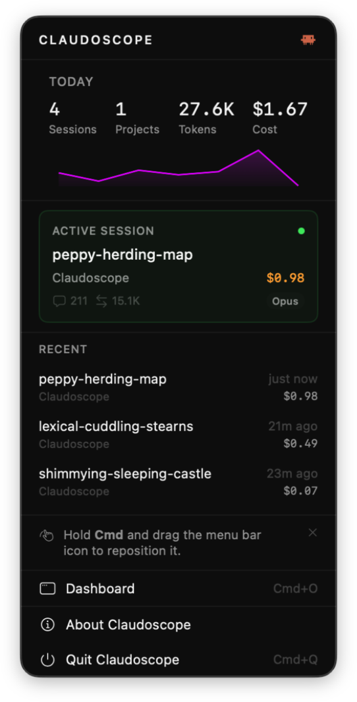
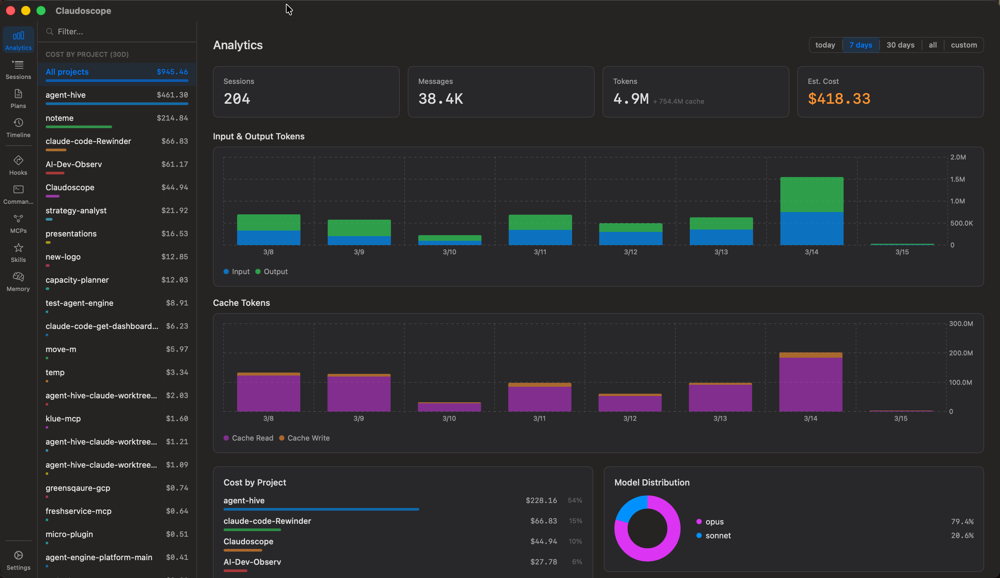
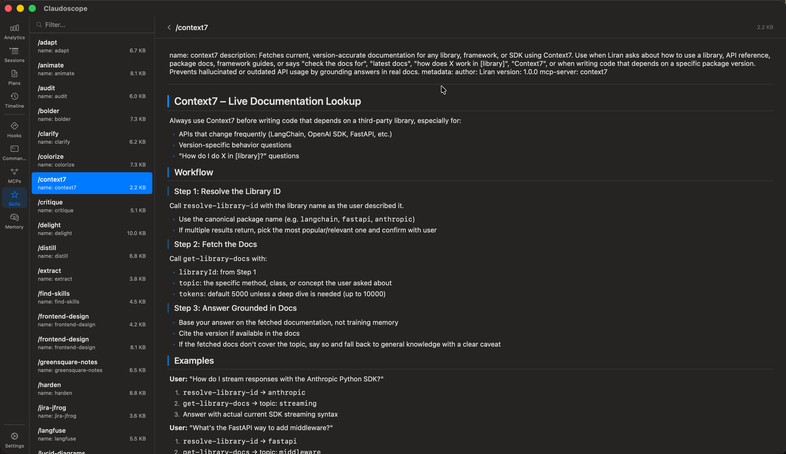
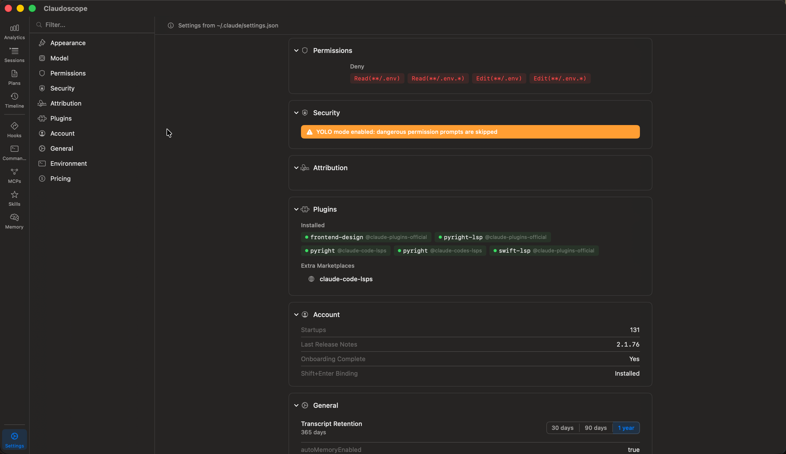

<p align="center">
  
</p>

<h1 align="center">Claudoscope</h1>

<p align="center">
  A native macOS menu bar app for exploring, analyzing, and managing your Claude Code sessions.
</p>

<p align="center">
  <a href="https://github.com/cordwainersmith/Claudoscope/releases/tag/v0.4.2"></a>
  <a href="https://claudoscope.com/"></a>
  
  
  <a href="https://dl.claudoscope.com/stats"></a>
</p>

---

Claudoscope reads your local Claude Code session files (`~/.claude/projects/`) and surfaces them through a compact menu bar widget and a full-featured dashboard window. It provides real-time session tracking, cost estimation, analytics, plan browsing, timeline history, and complete visibility into your Claude Code configuration, all without sending any data off your machine.

## Table of Contents

- [Requirements](#requirements)
- [Installation](#installation)
- [How It Works](#how-it-works)
- [Menu Bar Widget](#menu-bar-widget)
- [Dashboard Window](#dashboard-window)
  - [Analytics](#analytics)
  - [Sessions](#sessions)
  - [Plans](#plans)
  - [Timeline](#timeline)
  - [Hooks](#hooks)
  - [Commands](#commands)
  - [Skills](#skills)
  - [MCPs](#mcps)
  - [Memory](#memory)
  - [Settings](#settings)
- [Cost Estimation](#cost-estimation)
- [License](#license)

## Requirements

- macOS 14.0 (Sonoma) or later
- Claude Code installed and used at least once (so that `~/.claude/projects/` exists with session data)

## Installation

### Homebrew (recommended)

```bash
brew tap cordwainersmith/claudoscope
brew install --cask claudoscope
```

### Updating

Claudoscope checks for updates automatically via GitHub Releases. When a new version is available, an indicator appears in the menu bar popover and in Settings > Updates. Clicking "Download and Install" downloads the new DMG, verifies its code signature, replaces the app, and relaunches. No manual steps required.

You can also update via Homebrew:

```bash
brew upgrade --cask claudoscope
```

Or disable automatic checks entirely in Settings > Updates.

### Manual install

Download the latest `Claudoscope.dmg` from the [Releases](https://github.com/cordwainersmith/Claudoscope/releases) page, open it, and drag Claudoscope to your Applications folder.

## How It Works

Claudoscope monitors `~/.claude/projects/` using macOS FSEvents for near-instant file change detection. When Claude Code writes to a session file (JSONL format), Claudoscope picks up the change, parses the session metadata, and updates the UI in real time. There is no polling, no server process, and no network requests. Everything runs locally as a lightweight menu bar app.

On launch, Claudoscope performs a one-time scan of all existing session files to build the initial project and session index. From that point forward, only changed files are re-parsed. Parsed sessions are held in an LRU cache (capacity 20) to keep memory usage low while allowing instant re-access to recently viewed sessions.

The app runs as an accessory process (`LSUIElement = true`), meaning it lives in your menu bar without occupying space in the Dock. When you open the full dashboard window, the Dock icon appears temporarily and disappears again when the window is closed.

## Menu Bar Widget

The menu bar widget provides a quick glance at your Claude Code activity without leaving what you are working on.



**What the widget shows:**

- **Stats strip**: today's session count, total tokens consumed, estimated cost, and number of active projects
- **Sparkline chart**: a compact daily usage trend line showing recent activity patterns
- **Active session card**: if a Claude Code session has been active within the last 60 seconds, it appears here with the session title, model, and token count
- **Recent sessions**: the three most recently active sessions across all projects, with timestamps and truncated titles
- **Dashboard shortcut**: opens the full dashboard window (Cmd+O)

## Dashboard Window

The dashboard is a three-column layout: a narrow icon rail on the left for navigation, a sidebar in the middle for lists and filtering, and a main content panel on the right.

### Analytics



The analytics view aggregates token usage and cost data across all your Claude Code sessions. It provides:

- **Summary cards**: total sessions, messages, tokens, cache tokens, and estimated cost for the selected time range
- **Daily usage chart**: a bar chart showing daily token consumption (input, output, cache read, cache creation) over time
- **Project cost breakdown**: a ranked list of projects by estimated cost, with session count and token totals per project
- **Model distribution**: usage breakdown by model family (Opus, Sonnet, Haiku) showing turn counts and token volumes
- **Time range selector**: filter analytics to the last 7 days, 30 days, 90 days, or a custom date range
- **Project filter**: scope analytics to a single project or view all projects combined

### Sessions

The sessions view is the core session explorer. The sidebar lists all projects discovered under `~/.claude/projects/`, with sessions grouped by project. Selecting a session loads the full conversation in the main panel.

The chat view renders the complete conversation thread with:

- User messages, assistant responses, and tool use blocks
- Token usage per assistant turn (input, output, cache read, cache creation)
- Inline cost estimates per message
- Tool result content (file reads, bash output, search results)
- Error indicators on sessions or tool calls that encountered failures
- In-conversation search for finding specific messages within long sessions

### Plans

The plans view lists all plan files created by Claude Code's `/plan` command. Plans are displayed with their title, creation date, and the project they belong to. Selecting a plan renders the full markdown content in the main panel.

### Timeline

The timeline view shows a chronological history of Claude Code activity across all projects from the last 7 days. Each entry represents a session event with its timestamp, project context, and session title. This provides a unified view of when and where you used Claude Code.

### Hooks

The hooks view reads your Claude Code hook configuration and displays all registered hooks grouped by event type (e.g., `PreToolUse`, `PostToolUse`, `Notification`). Each hook entry shows its matcher pattern, the command it runs, and its timeout setting.

### Commands

The commands view lists all custom slash commands defined in your Claude Code configuration. Each command is displayed with its name, and selecting one renders the full command definition (typically markdown with the prompt template) in the main panel.

### Skills



The skills view displays all installed Claude Code skills. Skills are shown with their name and trigger description. Selecting a skill renders its full definition and documentation in the main panel.

### MCPs

The MCPs (Model Context Protocol servers) view shows all configured MCP servers from your Claude Code settings. Each entry displays the server name, command, arguments, and environment variables.

### Memory

The memory view lists all CLAUDE.md and memory files that Claude Code uses for persistent context. This includes the global `~/.claude/CLAUDE.md`, project-level `CLAUDE.md` files, and auto-memory files. Selecting a file renders its markdown content in the main panel.

### Settings



The settings view reads your `~/.claude/settings.json` and presents each configuration section in an organized, browsable layout:

- **Appearance**: switch between System, Light, and Dark themes. The selected theme applies to the dashboard window immediately.
- **Model**: shows the currently configured default model.
- **Permissions**: displays permission rules, including denied file patterns for read and edit operations.
- **Security**: surfaces security-related flags such as YOLO mode status and dangerous permission prompt handling.
- **Attribution**: attribution and credit configuration.
- **Plugins**: lists all installed plugins with their source marketplaces, and shows any extra marketplace sources.
- **Account**: displays account metadata including startup count, last release notes version, onboarding status, and key bindings.
- **General**: transcript retention period, auto-memory toggle, and other general preferences.
- **Environment**: environment-level configuration values.
- **Pricing**: choose between Anthropic API and Vertex AI pricing, with region selection for Vertex (Global, us-east5, europe-west1, asia-southeast1). Changing the pricing configuration recalculates all cost estimates across the app.

## Cost Estimation

Claudoscope estimates session costs from raw token counts stored in JSONL session files. These are informational estimates based on published API pricing, not actual billing data.

The estimation process:

1. **Token extraction**: the JSONL parser reads each assistant response and accumulates four token counters from the `usage` field: input tokens, output tokens, cache read tokens, and cache creation tokens.

2. **Model family detection**: the model ID string (e.g., `claude-opus-4-6-20250313`) is mapped to a pricing family. The version number matters because Opus 4.5+ and Haiku 4.5+ have different pricing from their predecessors.

3. **Pricing tables**: three tables are built in, all in dollars per million tokens:
   - **Anthropic API (direct)**: standard published rates including cache creation charges
   - **Vertex AI (Global)**: same input/output rates as Anthropic, but cache creation is free
   - **Vertex AI (Regional)**: 10% surcharge over global rates on input, output, and cache read

4. **Cost formula**: for each session, cost = (input / 1M * rate) + (output / 1M * rate) + (cache_read / 1M * rate) + (cache_creation / 1M * rate)

**Caveat**: these are estimates. Actual billed amounts depend on factors Claudoscope cannot observe, such as batch vs. real-time pricing tiers, committed-use discounts, or billing adjustments.

## License

MIT
