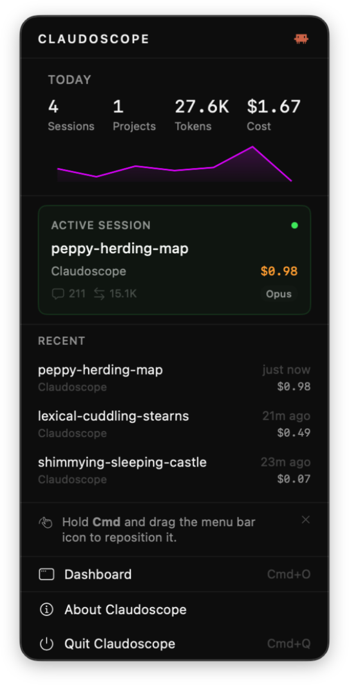
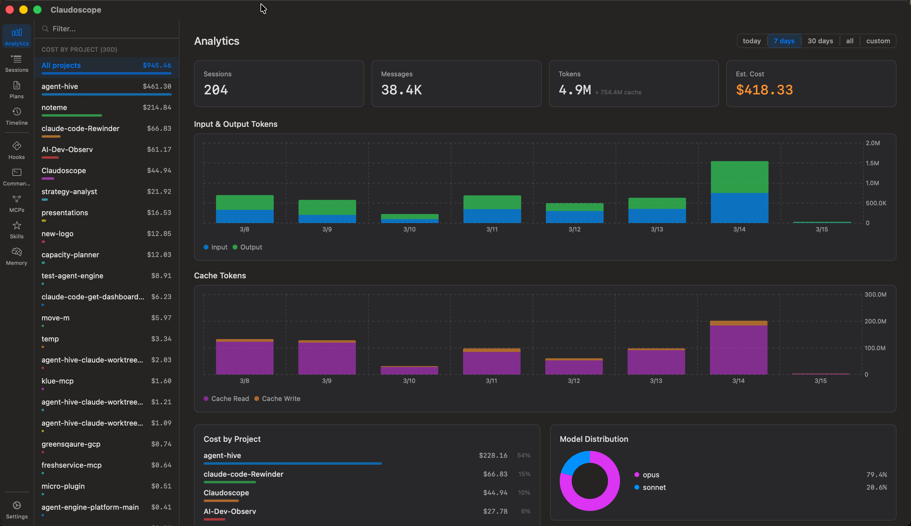
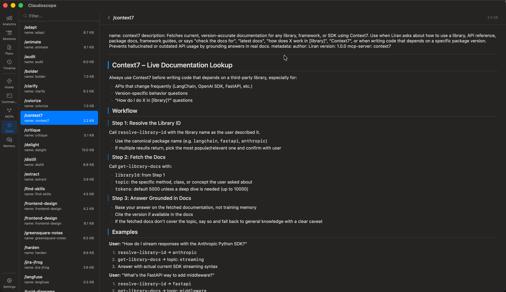
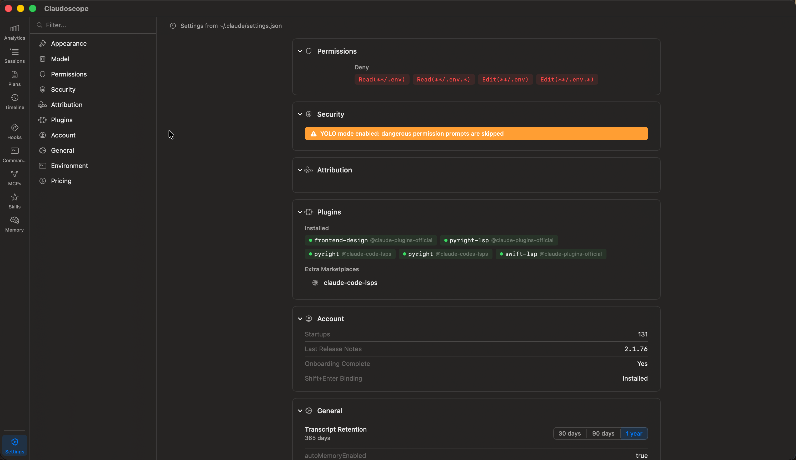

<p align="center">
  
</p>

<h1 align="center">Claudoscope</h1>

<p align="center">
  A native macOS menu bar app for exploring, analyzing, and managing your Claude Code and Cowork sessions.
</p>

<p align="center">
  <a href="https://github.com/cordwainersmith/Claudoscope/releases/latest"></a>
  <a href="https://claudoscope.com/"></a>
  
  
  <a href="https://dl.claudoscope.com/stats"></a>
</p>

<p align="center">
  <a href="https://www.producthunt.com/products/claudoscope?embed=true&utm_source=badge-featured&utm_medium=badge&utm_campaign=badge-claudoscope" target="_blank" rel="noopener noreferrer"></a>
</p>

<p align="center">
  <strong>🎉 Claudoscope 1.0 is here</strong>
</p>

<p align="center">
  Sessions now persist between launches, with cost alerts, notifications, and per-file diffs.<br />
  <a href="https://github.com/cordwainersmith/Claudoscope/releases/tag/v1.0.0">See what's new</a>
  &nbsp;·&nbsp;
  <a href="CHANGELOG.md">Full changelog</a>
</p>

---

Claudoscope reads your local Claude Code session files (`~/.claude/projects/`) and Claude Cowork sessions from the Claude desktop app, then surfaces them through a compact menu bar widget and a full-featured dashboard window. It provides real-time session tracking, cost estimation with [**spend alerts**](#notifications-and-cost-alerts), analytics, per-file diffs of everything Claude changed, plan browsing, timeline history, configuration health checks, [**a 1-click security hardening baseline that locks down your Claude Code environment**](#hardening), and [**secret scanning that detects leaked credentials in your session history with real-time alerts**](#secret-scanning), all without sending any data off your machine.

## Why Claudoscope

The first version displayed one number: roughly what I had spent in Claude Code that day. Then I wanted to know which session the number came from, then which project, then whether the expensive one was expensive because it did a lot or because it got stuck in a loop and burned cache on the same context forty times. Every feature since has been a version of the same question: what is Claude Code actually doing when I am not watching it?

The catch is that most of the answers are time-sensitive. A session going sideways is worth knowing about while it is going sideways. A leaked credential in a transcript matters most in the minutes after it lands. Claude sitting on a permission prompt while you read something in another window is pure dead time. A dashboard you have to remember to open has already failed at the part that mattered.

So Claudoscope works in both directions. It comes to you through [session notifications](#notifications-and-cost-alerts), [cost alerts](#notifications-and-cost-alerts), real-time [secret scanning](#secret-scanning), and an [MCP server](#settings) that lets Claude Code answer questions about your own usage without opening anything. And when you do want to dig, the [dashboard](#dashboard-window) has the full history: every session, every file Claude touched, every plan, and a [config linter](#config-health) for the setup underneath it all.

Everything runs locally. No telemetry, no account, no network calls beyond checking for updates.

Full version history is in [CHANGELOG.md](CHANGELOG.md).

## Table of Contents

- [Why Claudoscope](#why-claudoscope)
- [Requirements](#requirements)
- [Installation](#installation)
- [How It Works](#how-it-works)
- [Secret Scanning](#secret-scanning)
- [Hardening](#hardening)
- [Menu Bar Widget](#menu-bar-widget)
- [Notifications and Cost Alerts](#notifications-and-cost-alerts)
- [Dashboard Window](#dashboard-window)
  - [Analytics](#analytics)
  - [Sessions](#sessions)
  - [Tools](#tools)
  - [Plans](#plans)
  - [Timeline](#timeline)
  - [Cowork](#cowork)
  - [Tasks & Jobs](#tasks--jobs)
  - [Hooks](#hooks)
  - [Commands](#commands)
  - [MCPs](#mcps)
  - [Skills](#skills)
  - [Agents](#agents)
  - [Plugins](#plugins)
  - [Memory](#memory)
  - [Canon](#canon)
  - [Config Health](#config-health)
  - [Agent Routing](#agent-routing)
  - [Settings](#settings)
- [Command Palette](#command-palette)
- [Cost Estimation](#cost-estimation)
- [Acknowledgments](#acknowledgments)
- [License](#license)

## Requirements

- macOS 14.0 (Sonoma) or later
- Apple Silicon Mac (M1 or later). Intel Macs are not currently supported.
- Claude Code installed and used at least once (so that `~/.claude/projects/` exists with session data)

## Installation

> Using an AI coding agent? Point it at [`AGENT-INSTALL.md`](AGENT-INSTALL.md) and it will handle the Homebrew install for you.

### Homebrew (recommended)

```bash
brew tap cordwainersmith/claudoscope
brew install --cask claudoscope
```

### Updating

Claudoscope checks for updates automatically via GitHub Releases. When a new version is available, an indicator appears in the menu bar popover and in Settings > Updates. Clicking "Download and Install" downloads the new DMG, verifies its code signature, replaces the app, and relaunches. No manual steps required.

You can also update via Homebrew:

```bash
brew upgrade --cask claudoscope
```

Or disable automatic checks entirely in Settings > Updates.

### Manual install

Download the latest `Claudoscope.dmg` from the [Releases](https://github.com/cordwainersmith/Claudoscope/releases) page, open it, and drag Claudoscope to your Applications folder.

## How It Works

Claudoscope monitors `~/.claude/projects/` using macOS FSEvents for near-instant detection of changes to JSONL session files. Updates parse incrementally and surface in the UI in real time. No polling, no server process, no network requests, everything runs locally.

Parsed session summaries persist in a local SQLite index, so launching paints the dashboard from disk immediately (sub-second on a ~3,000-file corpus) instead of re-reading every transcript. A background pass then re-parses only the files that actually changed. The index is a pure derivative of your session files: change the parser, the pricing tables, the provider, or your timezone and it rebuilds itself in the background. Delete it and nothing is lost. Fully parsed sessions are additionally held in an in-memory LRU cache for instant re-access while you browse.

The app runs as an accessory process (`LSUIElement = true`) and lives in your menu bar without a permanent Dock presence. The Dock icon appears only while the dashboard window is open.

Optionally, Claudoscope can expose its own data back to Claude Code through a read-only MCP server (off by default, see [Settings](#settings)), so you can ask Claude about your own usage.

## Secret Scanning

Claudoscope detects leaked credentials inside Claude Code session files and alerts you in real time. Ten credential patterns are scanned across your full Claude Code session history:

- Private keys (RSA, OpenSSH, PGP, EC)
- AWS access keys and secret access keys
- HTTP `Authorization` headers (Bearer, Basic)
- API keys and tokens
- Password literals in code, config, and connection strings
- Database connection strings with embedded credentials
- Platform tokens (GitHub PATs/OAuth, OpenAI, Anthropic, Stripe, Slack, npm, Google, SendGrid, Shopify, DigitalOcean, Linear, PyPI, HuggingFace, Azure, Vault, Docker)
- Slack incoming webhook URLs
- Critical platform tokens (Stripe live keys, Stripe webhook secrets, OpenAI service/admin keys, Anthropic admin keys, Azure storage account keys, Vault tokens) escalated to ERROR severity
- Subprocess credential exposure when env scrubbing is disabled

A multi-stage false-positive filter (Shannon entropy analysis, capture-group value extraction, randomness heuristics, and expanded allowlists for placeholders and conversational context) keeps noise low.

**Real-time alerts**: when a session file is updated, Claudoscope scans the tail of the file for new credentials and pops a floating alert panel on a match. Toggle in Settings > Security.

**Background full-history scan**: a complete sweep of all session files runs in the background under [Config Health](#config-health) and reports every match grouped by rule. Config and session checks load instantly while secret scanning progresses with an inline indicator.

All scanning is local. Detected secrets never leave your machine, and Claudoscope never transmits session content over the network.

## Hardening

Claude Code is powerful by design: it reads your filesystem, runs shell commands, and reaches outbound networks. Out of the box, those capabilities ship with very few guardrails. Claudoscope's Hardening view (the Hardening section of the [Health](#config-health) rail) installs a vendor-neutral security baseline into `~/.claude/` in a single click, then continuously verifies that the baseline stays in place.

The baseline is layered, so weakening any single layer does not unlock the others:

- **Permissions and Sandbox.** Hard-deny rules block reads and writes to credential paths (`~/.ssh/`, `.netrc`, `.npmrc`, `secrets/`), block destructive shell commands (`rm -rf /`, `sudo`, `chmod 777`, `eval`, `git push --force`, `git reset --hard`), and block pipe-to-shell exfiltration (`curl ... | sh`). Sandbox isolation is turned on for tool execution.
- **Hooks.** Six PreToolUse and PostToolUse shell hooks vet every Bash, Edit, and Write call before it runs: a credential scanner, a command validator, a public-repo push guard, a proprietary-file flag, a package-age check that blocks dependencies less than 14 days old, and an intent guard for `git reset --hard`.
- **AutoMode.** Soft-deny rules require explicit user intent for high-risk operations. Force-pushes must name a target branch, `git reset --hard` requires a specific ref, and every `curl` or `wget` invocation requires the URL, the purpose, and explicit confirmation in the user's message.
- **Governance.** A marker-wrapped block is appended to your global `CLAUDE.md` so the agent has the rules in-conversation. This layer is advisory: the hard enforcement lives in the layers above.
- **Security skill.** A security-awareness skill is deployed that the agent can consult on demand for guidance on secrets, dangerous code patterns, and external connectivity.

**Reversible by design.** Before writing anything, the installer takes a full backup of your existing `~/.claude/` configuration. Three lifecycle actions are always one click away from the rail:

- **Install / Reinstall** refreshes every layer from the bundled baseline.
- **Revert** restores the pre-install state from the auto-backup.
- **Uninstall** surgically removes every Claudoscope-installed artifact, leaving any rules you added by hand intact.

**Drift detection.** Eleven lint checks (HRD001 through HRD011) verify each layer stays in place after install. If a deny rule, hook, or governance block goes missing, the rail flags the drift, explains the impact in plain language, and offers a one-click fix.

**Trusted Sources.** A dedicated sheet lets you curate the hosts, package registries, and repositories the agent is permitted to reach without explicit approval. Anything off the list requires confirmation per request, with plain-language descriptions of what each entry unlocks.

Everything runs locally. The baseline installs into your existing `~/.claude/` directory and is never transmitted off your machine.

## Menu Bar Widget

At-a-glance Claude Code activity without leaving what you are working on.



- **Stats strip**: today's session count, total tokens, estimated cost, and active project count
- **Sparkline chart**: compact daily usage trend
- **Active session card**: the live session (active in the last 60 seconds) with title, model, and token count
- **Recent sessions**: the three most recently active sessions, excluding any already shown as active
- **Dashboard shortcut**: opens the full dashboard window (Cmd+O)
- **Settings shortcut**: opens preferences directly from the popover

The menu bar icon can be switched to a monochrome glyph in Settings > Appearance, which adapts to light, dark, and tinted menu bars. A red dot on the icon means a cost alert has fired.

## Notifications and Cost Alerts

Both are opt-in and off by default.

**Session notifications** tell you when a session needs you. Enabling them in Settings > Notifications installs Claude Code `Notification` and `Stop` hooks and delivers two independently toggleable banners: "Claude needs you" when a session is genuinely blocked on a permission, plan, or MCP prompt, and a "your turn" banner when Claude finishes. Both are event-driven, so neither nags on a timer. Tapping a banner focuses the terminal tab running that session (Ghostty, iTerm2, and Terminal.app). Includes per-project mute, daily quiet hours, and a sound toggle.

**Cost alerts** watch spend against four thresholds: a single-session cap, a rolling window (5 minutes to 4 hours, which doubles as runaway-burn detection), a daily total, and a monthly total. Alerts re-fire at each doubling (X, 2X, 4X) rather than repeating, arrive as a notification plus a red menu bar dot, and stay in the popover until dismissed. All figures are estimates.

## Dashboard Window

A three-column layout: a narrow icon rail on the left for navigation, a sidebar in the middle for lists and filtering, and a main content panel on the right.

A global project and date lens sits above the sidebar filter and scopes the Sessions, Tools, Timeline, and Plans rails at once, persisting as you move between them.

### Analytics



Aggregates token usage and cost data across all your Claude Code sessions. A Usage/Insights toggle at the top switches between the usage dashboard and the session-quality view.

**Usage** has three tabs:

- **Overview**: summary cards (sessions, messages, tokens, cache tokens, estimated cost), daily usage bar chart, project cost breakdown, and model distribution by family
- **Cache**: hit ratio with cache-busting detection, stability callout, 5-minute vs. 1-hour TTL tier breakdown, per-session efficiency ranking, model-aware savings estimate, and cached vs. uncached cost comparison
- **Models**: daily cost by model chart, model efficiency table, and a what-if calculator that estimates savings from switching Opus usage to Sonnet

All tabs share a time range selector (7/30/90 days or custom) and an optional project filter.

**Insights** reads the session facets Claude Code's `/insights` command writes locally (outcome, friction, satisfaction, goal categories, session type) and joins them to Claudoscope's cost engine: outcome distribution, friction frequency, and average cost by outcome, plus a per-session facet detail with a jump straight to the session. Facets exist only after you run `/insights`, so a coverage banner always states how many sessions are covered and when they were last generated.

### Sessions

The core session explorer. The sidebar lists all projects discovered under `~/.claude/projects/`, with sessions grouped by project. Each session row shows inline observability badges: error indicators (rate limits, auth failures, tool errors), idle/zombie gap warnings, and git worktree markers.

The chat view renders the complete conversation thread with:

- User messages, assistant responses, and tool use blocks
- Token usage per assistant turn (input, output, cache read, cache creation)
- Inline cost estimates per message
- Tool result content (file reads, bash output, search results)
- Error indicators on sessions or tool calls that encountered failures
- Blocked and denied actions, collapsed into their own group and classified as destructive git, infra destroy, permission denied, or user rejected, so you can see what Claude tried to do and was stopped from doing
- In-conversation search across messages, thinking blocks, tool inputs, and tool results, with auto-expansion of matching collapsed blocks
- A **Focus** toggle that hides thinking blocks and tool/MCP activity so you can read just the conversation. Filtering is display-only, so tokens and cost stay computed on the full transcript.

**Files tab.** Every session also has a Files tab listing each file Claude edited or wrote, with a chronological diff for every individual edit reconstructed from the transcript. Edits made by subagents are merged in with a badge and anchored to the call that spawned them. Each entry offers open, reveal in Finder, copy patch, and jump to the matching point in the chat, and files that changed on disk after the session touched them are flagged.

### Tools

Tool call data extracted from conversation history and presented per session, with a category breakdown (Read, Write, Exec, Other) and a detailed list of individual tool calls. Surfaces total calls, error rate, and unique files touched across sessions.

### Plans

All plan files created by Claude Code's `/plan` command, with title, creation date, and project. Selecting a plan renders the full markdown content.

### Timeline

Chronological history of Claude Code activity across all projects from the last 7 days. Each entry shows timestamp, project context, and session title.

### Cowork

Cowork is the agentic mode in the Claude desktop app where the agent works on long-running tasks in the background and reports back when complete. Cowork sessions live under `~/Library/Application Support/Claude/` in a different format from Claude Code's session files. The Cowork rail surfaces them inside Claudoscope alongside your Claude Code data, so you have one view of every Claude session you have ever run.

The rail appears automatically once Cowork is configured and at least one session exists on disk. If you do not use Cowork, the rail stays hidden. For each session you get:

- **Sidebar list** with title, project, model, working directory, last activity, and a per-session cost estimate
- **Full session metadata**: process name, project, model, slash commands run, the initial prompt, and any files Cowork detected as generated
- **Token and cost stats** computed from the audit transcript using the same pricing engine as the rest of Claudoscope, with per-model breakdowns when the session crossed model boundaries
- **The complete conversation transcript** rendered with the same chat view used for Claude Code sessions, including tool calls, results, and per-turn cost

Cowork spend is also rolled into the Analytics Est. Cost card so the dashboard reflects your true total Claude bill, not just the CLI portion.

### Tasks & Jobs

A monitor for Claude Code's local background machinery:

- **Background jobs** from `~/.claude/jobs/`: each job's state, timeline, token count, template/backend, and final result, with a live daemon supervisor status line. Job environment maps (`providerEnv`) are never decoded, so credentials stored in job state can never surface anywhere in the app.
- **Task lists** from `~/.claude/tasks/`: the per-session checklists Claude Code maintains, rendered with status icons and "blocked by" dependency chips, split into lists with open work and completed lists.

Where a job or task list belongs to a session whose transcript is still in your local corpus, an "Open session" button jumps straight to it.

### Hooks

A Configuration/Runtime toggle splits the rail into what is registered and what actually ran.

**Configuration** shows all registered Claude Code hooks merged from five sources (user, project, project-local, plugin, managed) and grouped by event type, including `PreToolUse`, `PostToolUse`, `PermissionDenied`, `SessionStart`, `SessionEnd`, `Stop`, `UserPromptSubmit`, `Notification`, `PreCompact`, `PostToolUseFailure`, `FileChanged`, and any new event types as they appear. Each entry shows matcher pattern, command, timeout, and source label.

**Runtime** folds the hook execution records Claude Code writes into transcripts across every parsed session: per-hook fire counts, failure counts, average and max duration, how many sessions each hook ran in, and a "not in config" badge for commands that appear in old transcripts but match no currently registered hook. Sidebar event rows carry fire and failure counts, and the chat view marks each Stop-hook batch inline, including one that blocked continuation.

### Commands

All custom slash commands defined in your Claude Code configuration. Selecting a command renders its full markdown definition with the prompt template.

### MCPs

All configured MCP (Model Context Protocol) servers from your Claude Code settings, with server name, command, arguments, and environment variables. Remote servers also show a best-effort auth state derived from local files only, so no tokens are ever read.

### Skills



All installed Claude Code skills, with name and trigger description. Selecting a skill renders its full definition and documentation.

### Agents

A read-only inventory of every agent definition installed on your machine, merged from your user directory, each project's `.claude/agents/`, and any plugins that ship agents. Agents installed by Claudoscope's [Agent Routing](#agent-routing) view are grouped into a pinned section with a badge, so it is always clear which ones came from the app and which are yours.

### Plugins

Every Claude Code plugin installed on your machine, with the components each one contributes: commands, skills, agents, hooks, and MCP servers. Expand a plugin to see its component names grouped by kind, and click any component to open its source (a skill's `SKILL.md`, a command or agent definition, or a hook/MCP config block) in a sheet.

The rail also runs three dependency checks: a plugin that declares a dependency which is not installed or enabled, a dependency cycle between plugins, and a plugin that contributes no components at all.

**Channel plugins** get their own checks (**CHN**), because they behave unlike any other plugin: a channel lets an external endpoint push messages directly into a live session, and a two-way channel can opt into relaying tool-permission prompts so approvals can be answered remotely. Claudoscope flags each enabled channel plugin as that surface, notes when one is enabled on a Vertex or Bedrock setup where Claude Code silently ignores channels entirely, and reports the `channelsEnabled` org-policy key whenever it is set. Results appear under Plugins in [Config Health](#config-health).

### Memory

All `CLAUDE.md` and memory files Claude Code uses for persistent context: the global `~/.claude/CLAUDE.md`, project-level `CLAUDE.md` files, and auto-memory files. Selecting a file renders its markdown content.

### Canon

Memory files are per-machine. Canon is the opposite: a per-project record of settled engineering decisions that lives in the repo and is committed with the code, so everyone (and every agent) working on it shares the same context.

Enabling Canon for a project installs a protocol rule and a seeded records file into that project's working tree, after which Claude Code appends decisions as they get settled. The rail itself is a reader: records appear as structured cards with a kind filter and a hide-superseded toggle. Claudoscope installs and displays canon, it never writes records.

Opt-in is per project, with bulk enable and disable available in Settings. A CAN lint family reports drift (missing protocol, gitignored records, malformed records, an outdated protocol, or a supersede pointing at nothing) in [Config Health](#config-health).

### Config Health

The Health rail has three sections behind one icon: **Health** (the linter below), **Hardening** (the [security baseline](#hardening)), and **Routing** ([Agent Routing](#agent-routing)). All three read the same lint results.

The Health section runs 72 lint rules across your Claude Code configuration, sessions, and security posture, grouped into six categories: Security, Session Performance, Skills & Hooks, Configuration, Plugins, and Canon. Two further families live in the sibling sections: seven Agent Routing drift checks (RTG) in [Agent Routing](#agent-routing), and thirteen hardening-baseline drift checks (HRD001 through HRD013) in [Hardening](#hardening).

- **Health score**: weighted summary (Excellent / Good / Fair / Poor) from error and warning counts
- **Severity filters**: click any stat card (Errors, Warnings, Info) to toggle on or off
- **Group by Rule** (default): collapses repeats, so "Missing description" shows once with a count and expandable list of affected skills, not 28 identical rows
- **Group by File**: flat list of all issues ordered by file
- **Rescan**: re-run all checks without switching tabs
- **Skill display names**: skills identified by directory name (e.g. "animate", "context7") instead of the repeated "SKILL.md" filename

Rule families: CLAUDE.md size and structure (**CMD**), rules YAML frontmatter and glob validation (**RUL**), skill metadata completeness and naming conventions (**SKL**), hook matcher validity (**HOOK**), plugin dependency integrity (**PLG**), channel plugin exposure (**CHN**), canon protocol and record health (**CAN**), cross-cutting token budget estimates (**XCT**), and settings validation (**CFG**).

**Secret detection** (**SEC** rules) scans session JSONL files for accidentally leaked credentials across ten patterns, with a multi-stage false-positive filter and real-time alerts on new matches. See [Secret Scanning](#secret-scanning) for the full feature.

**Session health checks** (**SES** rules) analyze actual usage data from the last 30 days:

- **SES001**: session cost exceeded $25
- **SES002**: conversation triggered frequent context compaction
- **SES003**: cumulative token consumption exceeded expected spending
- **SES004**: session idle for 7+ days with 50+ messages
- **SES005**: session experienced API errors (rate limits, auth failures, proxy errors, tool errors)
- **SES006**: session resumed after 75+ minutes idle without `/clear` (zombie session)

Each session triggers at most one check (the most severe), capped at 10 results. Session results carry token and message count badges; "View Session" navigates directly to the session in the Sessions rail.

**Settings validation** (**CFG** rules) checks your `settings.json` for misconfigurations: sandbox enabled without lock files, contradictory filesystem permissions, bare mode conflicting with hooks/MCP, missing subprocess environment scrubbing, and skill shell execution without restriction.

### Agent Routing

Claude Code will happily use its most expensive model for a task that a cheaper one would finish just as well. This view (the Routing section of the [Health](#config-health) rail) installs a set of role-scoped subagents into `~/.claude/agents/` so work gets routed by what it actually needs: `recon` and `Explore` for read-only lookups and sweeps, `routine` for fully-specified mechanical edits, `builder` for work requiring judgment, `checker` for fresh-context verification, plus `security-review` and `security-build` for security-sensitive work.

Installing also appends a marker-delimited orchestration policy to your global `CLAUDE.md` and sets a fallback model if you do not already have one. Install, reinstall, revert, and uninstall work the same way as the [Hardening](#hardening) section: every write is preceded by a timestamped, owner-only backup, and uninstall deliberately leaves behind any agent file you have edited yourself. An RTG lint family reports drift from the installed baseline.

### Settings



Reads your `~/.claude/settings.json` and presents each configuration section in an organized layout:

- **Appearance**: System, Light, or Dark theme applied to the dashboard immediately, plus the monochrome menu bar icon toggle
- **Model**: currently configured default model
- **Permissions**: permission rules and denied file patterns for read and edit operations
- **Security**: YOLO mode status, dangerous permission prompt handling, weaker sandbox settings, skill shell execution status, plus a toggle for real-time secret scanning alerts
- **Attribution**: attribution and credit configuration
- **Plugins**: installed plugins, source marketplaces, and any extra marketplace sources
- **Account**: startup count, last release notes version, onboarding status, key bindings
- **General**: an "Open Claudoscope at login" toggle (with a prompt to re-enable it if macOS Login Items has it blocked), transcript retention period, auto-memory toggle, and other preferences
- **Environment**: environment-level configuration values
- **Pricing**: Anthropic API or Vertex AI pricing with region selection (Global, us-east5, europe-west1, asia-southeast1). Changing the pricing configuration recalculates all cost estimates across the app.
- **Notifications** and **Cost Alerts**: see [Notifications and Cost Alerts](#notifications-and-cost-alerts)
- **MCP Server**: enables the read-only MCP server (off by default) and registers it with Claude Code, so you can query your own usage data from a session
- **Canon**: bulk enable or disable canon across projects
- **Updates**: automatic update checks, with an option to turn them off entirely

## Command Palette

Press **Cmd+K** to open the command palette for quick navigation between rails and actions. Start typing to filter, then press Enter to jump.

## Cost Estimation

Claudoscope estimates session costs from raw token counts stored in JSONL session files. These are informational estimates based on published API pricing, not actual billing data.

For each assistant response, the JSONL parser accumulates four counters from the `usage` field: input tokens, output tokens, cache read tokens, and cache creation tokens. Cache creation is split across the 5-minute and 1-hour TTL tiers, which bill at different rates.

The model ID (e.g. `claude-opus-4-6-20250313`) maps to a pricing family. Detection matches an explicit closed list of the generations that actually billed at older rates (Claude 3 Opus, Opus 4 and 4.1, Haiku 3 and 3.5); everything else prices at current rates. This direction is deliberate: a model ID Claudoscope has never seen is far more likely to be new than ancient, so an unknown ID fails safe to the current rate instead of silently inheriting a legacy one. Fable 5 is recognized as its own family rather than being shown as unknown.

Three pricing tables are built in (dollars per million tokens):

- **Anthropic API (direct)**: standard published rates including cache creation charges
- **Vertex AI (Global)**: same input/output rates as Anthropic, cache creation is free
- **Vertex AI (Regional)**: 10% surcharge over global rates on input, output, and cache read

Per-session cost is `(input + output + cache_read + cache_creation) / 1M`, each multiplied by its model rate.

**Web search requests** are billed on top of tokens at $0.01 per search. Claude Code records the count in `toolUseResult.searchCount` on the tool-result record rather than in the documented `usage.server_tool_use.web_search_requests` field, which is always zero in transcripts, so the fee is read from there, deduped by record, and attributed to the day and model that issued it.

**Caveat**: actual billed amounts depend on factors Claudoscope cannot observe, such as batch vs. real-time pricing tiers, committed-use discounts, or billing adjustments.

## Acknowledgments

Special thanks to [Nitzan Gotlib](https://github.com/nitzango) ([LinkedIn](https://www.linkedin.com/in/nitzang/)) for the security hardening baseline that powers the [Hardening](#hardening) rail.

## License

MIT
